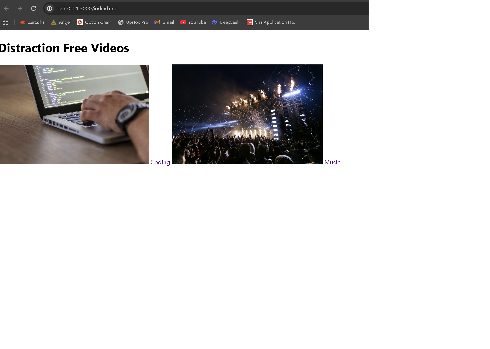
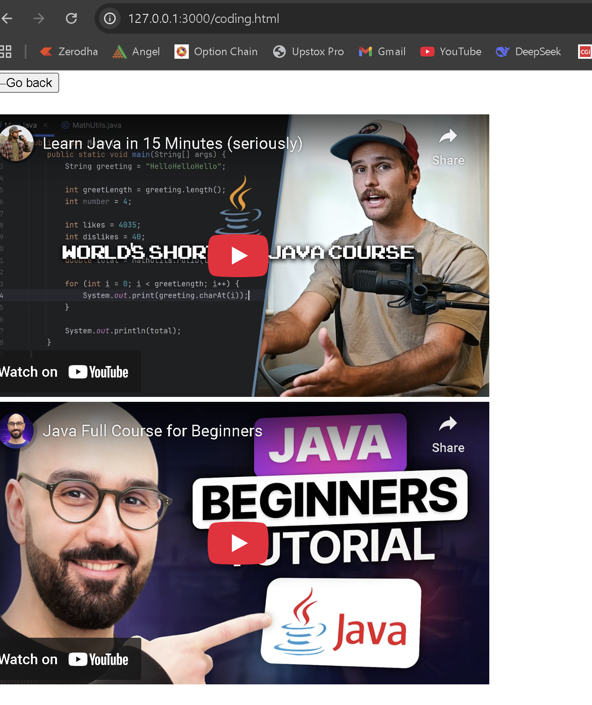

# Distraction-Free YouTube

A minimal web project that lets you watch YouTube videos without side distractions.

\## ✨ Idea

YouTube is full of recommendations and feeds that can steal focus.  

This project creates a \*\*clean, single-video viewer\*\* where you paste a video link and watch without scrolling away.

\## 🚀 Features

\- Paste a full YouTube URL or just the video ID.

\- Video opens in a distraction-free player.

\- Clean HTML + CSS, no frameworks needed.

\## 📖 How to Use

1\. Open \[the live demo](https://aaart45.github.io/distraction-free-youtube/) (after enabling GitHub Pages).

2\. Paste a YouTube video link.

3\. Enjoy the video with no comments, no sidebar, no feed.

Here’s what Distraction-Free YouTube looks like:

Here is what inside of coding page looks like - 

\## 🛠️ Tech Stack

\- HTML

\## 📜 License

MIT

